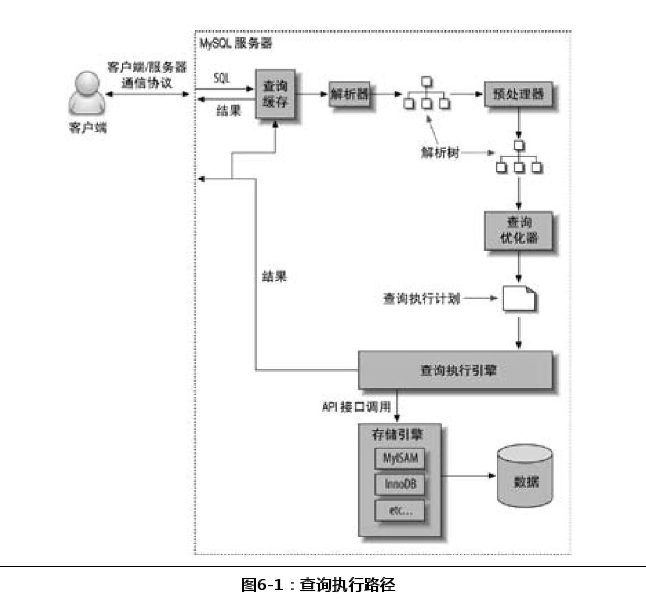

#查询为什么慢 
如果把查询看作是一个任务，那么它由一系列子任务组成， 每个子任务都会消耗一定的时间。 

如果要优化查询 ，实际上要优化其子任务，要么消除其中一些子任务，要么减少子任务的执行次数，要么让子任务运行得更快。

#查询的生命周期
通常来说，查询的生命周期大致可以按照顺序来看：从**客户端**，到**服务器**，然后在**服务器上进行解析**，**生成执行计划**，**执行**，并**返回结果给客户端**。   
其中 **执行** 可以认为是整个生命周期中最重要的阶段，这其中包括了大量为了检索数据到存储引擎的调用以及调用后的数据处理，包括排序、分组等。

#低效查询的分析方向
1. 是否向数据库请求了不需要的数据  
   确认应用程序是否在检索大量超过需要的数据。这通常意味着访问了太多的行，但有时候也可能是访问了太多的列。
2. MySQL是否在扫描额外的记录  
   确认MySQL服务器层是否在分析大量超过需要的数据行
   
#查询执行的基础
   
   1. 客户端发送一条查询给服务器。
   2. 服务器先检查查询缓存，如果命中了缓存，则立刻返回存储在缓存中的结果。否则进入下一阶段。
   3. 服务器端进行SQL解析、预处理，再由优化器生成对应的执行计划